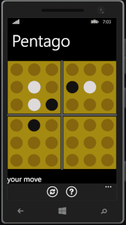
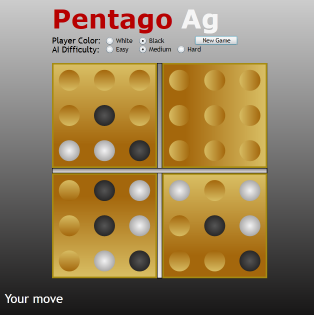

# Pentago AG

An AI engine, Silverlight UI, and Windows Phone UI for the board game [Pentago](http://en.wikipedia.org/wiki/Pentago).

Originally written back in 2009/2010 and hosted at http://pentagoag.codeplex.com/.

If the mood strikes me, I will get back to working on this again, probably rewriting the engine in F#.

  